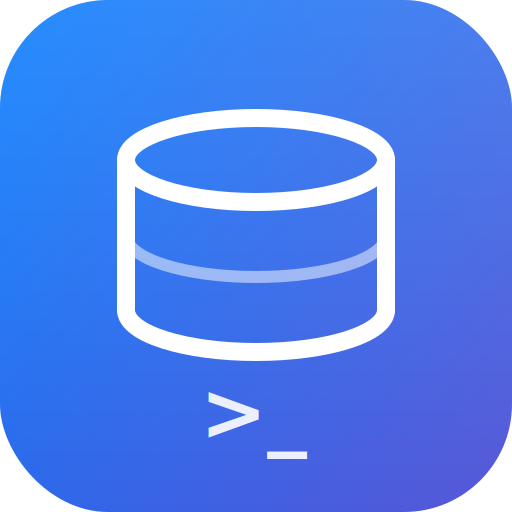

<p align="center">
  
</p>

<h1 align="center">SQL Studio</h1>

<p align="center">
  <strong>A fast, native database client for developers who hate bloat.</strong>
</p>

<p align="center">
  
  
  
  
  
</p>

---

## What is this?

SQL Studio is a lightweight, native desktop SQL editor inspired by [Sequel Pro](https://www.sequelpro.com/). Built with **Tauri 2.0 + React + Rust** — it launches instantly, connects fast, and stays out of your way.

No Electron. No 500MB RAM. Just a clean tool that does the job.

## Features

- **Multi-database** — MySQL & PostgreSQL, switch with one click
- **Favorites** — Save, name, and color-code your connections
- **Multi-tab connections** — `Cmd+T` to open a new connection tab, work across databases simultaneously
- **Standard / Socket / SSH** — Connect however you need (SSH coming soon)
- **4-view workspace** — Content, Structure, Relations, and Query views per table
- **Table structure inspector** — Column types, keys, defaults, extras, and comments at a glance
- **Foreign key relations** — See how your tables are connected
- **Query editor** — Syntax-friendly editor with line numbers, `Cmd+Enter` to run
- **Data grid** — Fast table rendering with row numbers, null highlighting, alternating rows
- **Schema tools** — Create table templates, one-click schema refresh
- **Persistence** — Your favorites and table comments survive restarts
- **Color-coded connections** — 5 colors to visually distinguish your dev, staging, and prod databases

## Stack

| Layer | Tech |
|-------|------|
| **Desktop runtime** | Tauri 2.0 |
| **Backend** | Rust (`mysql` + `postgres` crates) |
| **Frontend** | React 18 + TypeScript |
| **Build** | Vite |
| **Styling** | Vanilla CSS (zero dependencies) |

Total dependencies: minimal. App size: ~15MB.

## Quick Start

**Prerequisites:** Node.js 20+, Rust toolchain, MySQL/PostgreSQL running locally.

```bash
# Clone & install
git clone <your-repo-url>
cd sql-studio
npm install

# Launch
npm run tauri dev
```

That's it. Connect to `127.0.0.1:3306` with your credentials and go.

## Keyboard Shortcuts

| Shortcut | Action |
|----------|--------|
| `Cmd + Enter` | Run query |
| `Cmd + T` | New connection tab |
| `Cmd + W` | Close current tab |
| `Tab` | Insert 2 spaces in editor |

## Screenshots

> *Coming soon — the app is better seen than described.*

## Roadmap

### Phase 1 — Core Editor ✅
- [x] MySQL + PostgreSQL connections
- [x] Favorites system with color coding
- [x] Multi-tab connections
- [x] Standard / Socket / SSH connection types
- [x] Content, Structure, Relations, Query views
- [x] Table comments & persistence
- [x] Create table templates
- [x] Schema refresh

### Phase 2 — AI Plugin 🚧 *In Progress*
> **Natural language to SQL, right inside the editor.**

Write what you want in plain English, get the SQL. No copy-pasting from ChatGPT.

```
"Give me max salary from employees where joining date > 2025 June 1st"
```
↓
```sql
SELECT MAX(salary) FROM employees WHERE joining_date > '2025-06-01';
```

Planned providers:
- Ollama (local, private)
- OpenAI-compatible APIs (bring your own key)

---

<p align="center">
  <sub>Built with Tauri, React, and Rust. Designed to feel native because it is.</sub>
</p>
